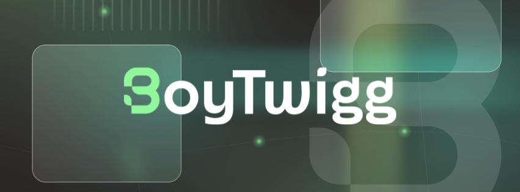

<p align="center">
  
</p>

# Hi, I’m Alex Malebranche 👋🏾

I build practical AI, automation, and operations products for people doing real work. I start with the workflow: who owns it, where it breaks, what needs judgment, and what can run without someone chasing it every day.

My work sits across product, operations, and implementation. I have worked in enterprise tech, founded businesses, served in Army intelligence, and now build AI systems for venture firms, executives, and small teams.

<p align="left">
  <a href="https://www.boytwigg.ai"></a>
  <a href="https://www.linkedin.com/in/boytwigg"></a>
  <a href="https://github.com/boytwigg"></a>
  <a href="./USER-MANUAL.md"></a>
  <a href="mailto:me@boytwigg.ai"></a>
</p>

## What I Work On

- AI agent teams with clear roles, permissions, handoffs, and human approval points
- Workflow and operations design for teams that have outgrown spreadsheets, inboxes, and memory
- Product requirements and implementation plans that connect user needs to a working system
- Documentation and training that let a client run what I build

I care about products people can use on a normal Tuesday. The work has to fit the team, make ownership clear, and hold up after the demo.

## Selected Work

| Project | What it shows |
| --- | --- |
| **[VC Agent Architecture](https://github.com/boytwigg/vc-agent-architecture)** | A reference build for a 5-agent venture capital team. It covers roles, boundaries, handoffs, privacy considerations, and a phased rollout. |
| **[BoyTwigg AI](https://github.com/boytwigg/BoyTwigg-Consulting)** | Public examples of operations design, AI-agent work, workflow automation, data migration, and client delivery. |
| **[Legal Operations Buildout](https://github.com/boytwigg/BoyTwigg-Consulting/tree/main/portfolio)** | A small-business engagement that migrated 900 records, documented 21 workflows, and created 30 reusable task templates. |

## Repositories to Pin

1. **vc-agent-architecture**. Best example of how I think about agent roles, controls, and rollout.
2. **BoyTwigg AI**. Broadest view of the work, including client-facing artifacts and portfolio examples.
3. **A focused implementation repo**. Pin the strongest current build that shows requirements, workflow logic, and a useful output. Keep it small enough that someone can inspect it in one sitting.

## How I Work

```text
Understand the user → trace the workflow → define the requirements → build the useful version → learn from use
```

I ask direct questions early. What is the task? Who owns the decision? What happens when the system is wrong? What does the person using it need to see or approve?

The answers shape the build. They also keep a promising idea from becoming another tool nobody trusts.

## Background

I run [BoyTwigg AI](https://www.boytwigg.ai), where I design AI operations systems and support teams as a fractional operator. I am also a founding Chief of Staff and AI Automation Engineer at BAG Ventures, an enterprise-AI venture firm.

Before that, I worked in technology roles at AWS, GitHub, Cloudflare, Plume Design, and Amazon. I am a first-generation Haitian American, U.S. Army Intelligence veteran, PMP, and Executive MBA candidate.

## Current Interests

- AI systems for high-stakes operational work
- Permissioning, memory, and approval design in multi-agent products
- Clear ways for nontechnical teams to govern AI-enabled workflows
- Small public builds that show the decisions behind the system

## AI Builder Toolbox

These are tools I use to move from an idea to a working system. The mix changes with the job.

**Build with AI**

<p align="left">
  
  
  
  
  
  
  
  
  
  
  
</p>

**Automate and Operate**

<p align="left">
  
  
  
  
  
  
</p>

**Ship and Integrate**

<p align="left">
  
  
  
  
</p>
